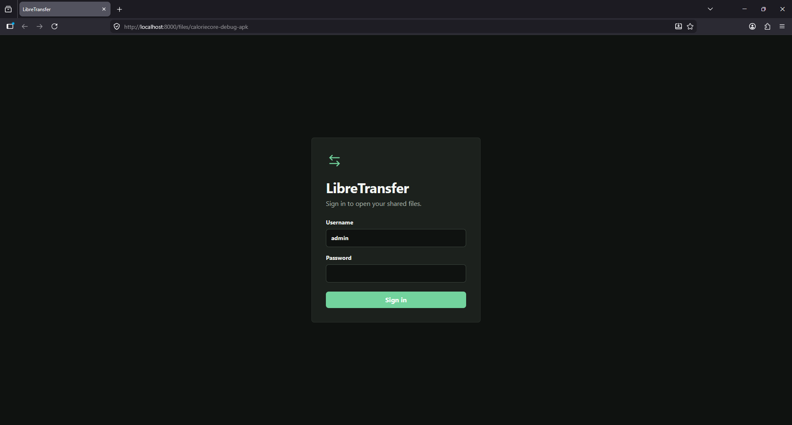
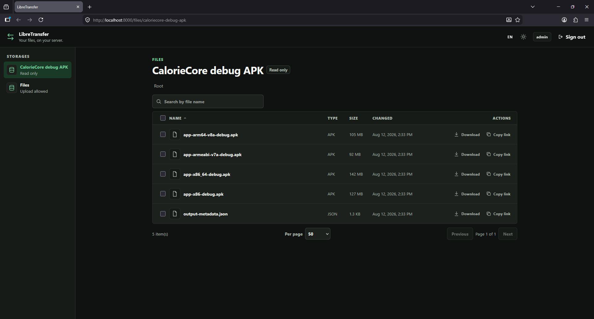
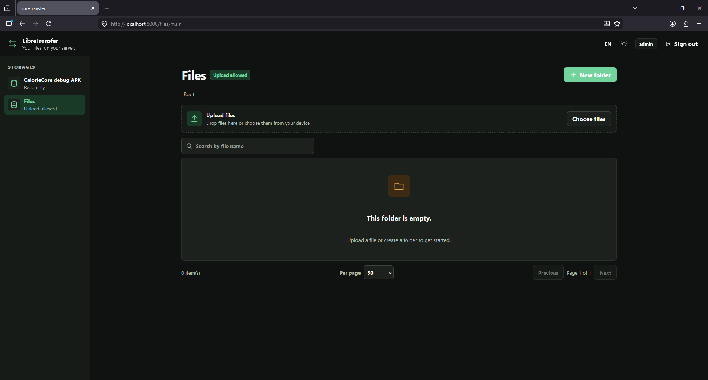

# LibreTransfer

LibreTransfer is a small web app for sharing files from a computer or server.
Files stay in normal folders on disk. Shared folders are set in `config.json`, and
account data is saved in SQLite.

## Features

- Admin and member accounts
- Multiple shared folders
- Upload, download, rename, search, and delete
- Resumable uploads
- English and Hungarian interface

## Setup

You need Node.js 24 and pnpm 11.

```text
pnpm install --frozen-lockfile
```

Copy `.env.example` to `.env` and `config.example.json` to `config.json`.

For local setup, remove `LIBRETRANSFER_ADMIN_PASSWORD` from `.env`. Then create the
first admin and start the development servers:

```text
pnpm cli app setup
pnpm dev
```

Open `http://127.0.0.1:5173`. The API runs on `http://127.0.0.1:8000`.

To build and run the normal app:

```text
pnpm build
pnpm start
```

Open `http://127.0.0.1:8000`.

## Commands

```text
pnpm cli help
pnpm cli help app
pnpm cli help user

pnpm cli app setup
pnpm cli app start

pnpm cli user add username
pnpm cli user add username --admin
pnpm cli user list
pnpm cli user rename old-name new-name
pnpm cli user password username
```

New users are members unless you add `--admin`. Passwords are entered in a hidden
prompt and must contain at least 10 characters. Changing a password signs out the
old sessions for that user.

## Configuration

Use [`.env.example`](.env.example) for server settings and
[`config.example.json`](config.example.json) for shared folders.

A relative folder path starts from the folder that contains `config.json`. Set
`allow_upload` to `false` for a read-only folder. Restart the server after changing
either config file.

`LIBRETRANSFER_ADMIN_PASSWORD` only creates the first admin without a prompt. It is
useful for Docker, but LibreTransfer saves the password hash in SQLite.

## Docker

Create `.env` and `config.json`, then set `LIBRETRANSFER_ADMIN_PASSWORD` in `.env`.
To mount a different host folder, set `LIBRETRANSFER_FILES_PATH` as well.

```text
docker compose up --build -d
```

## Screenshots

| Login                                                                            | Read-only folder                                                                            | Writable folder                                                                                  |
| -------------------------------------------------------------------------------- | ------------------------------------------------------------------------------------------- | ------------------------------------------------------------------------------------------------ |
| [](docs/screenshots/login.png) | [](docs/screenshots/file_browser.png) | [](docs/screenshots/empty_folder.png) |
